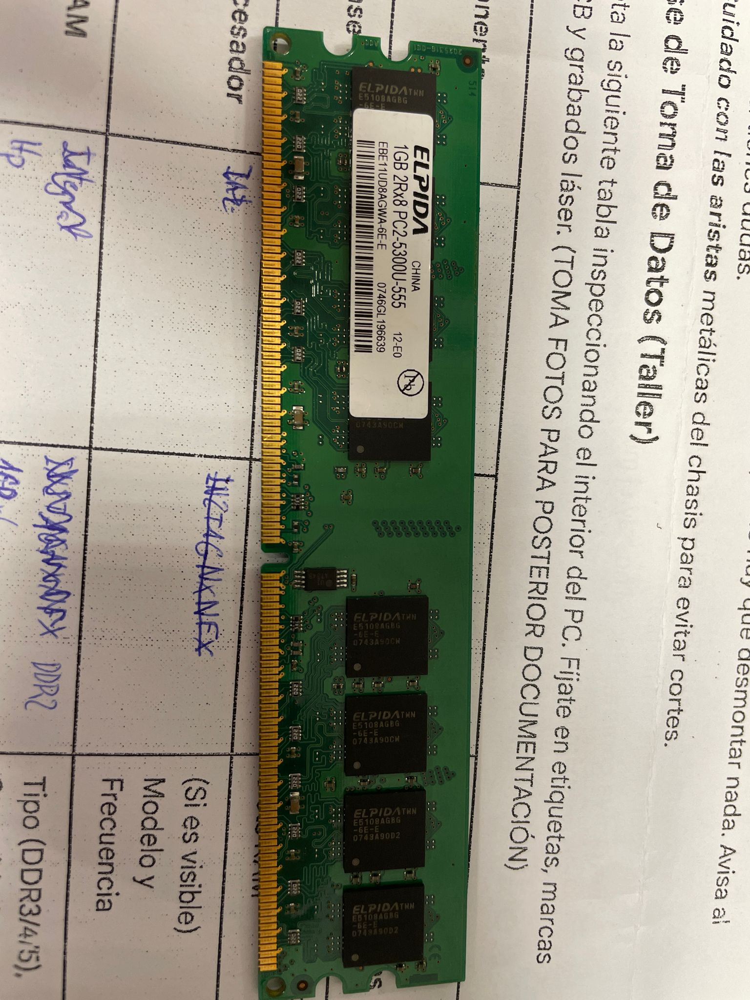
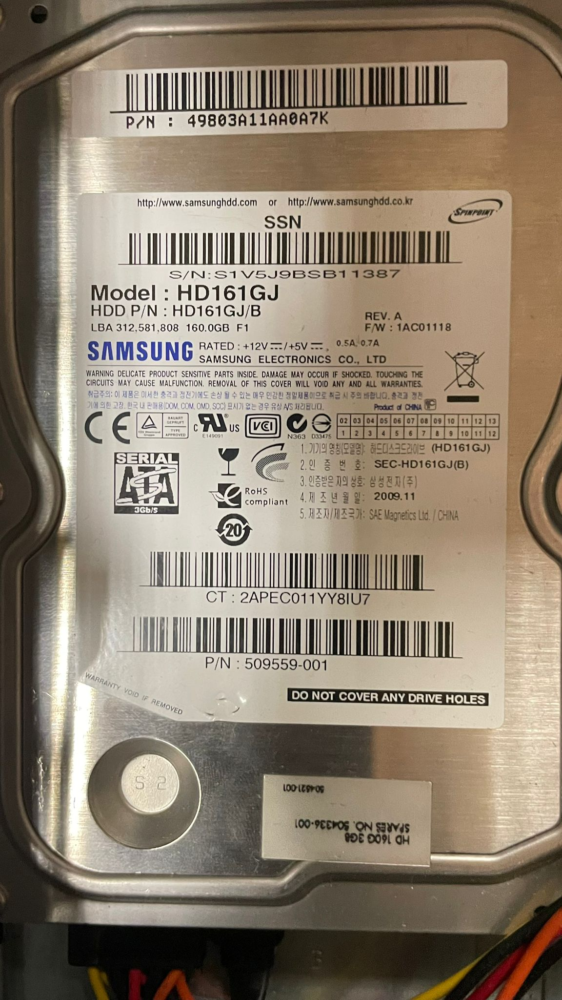
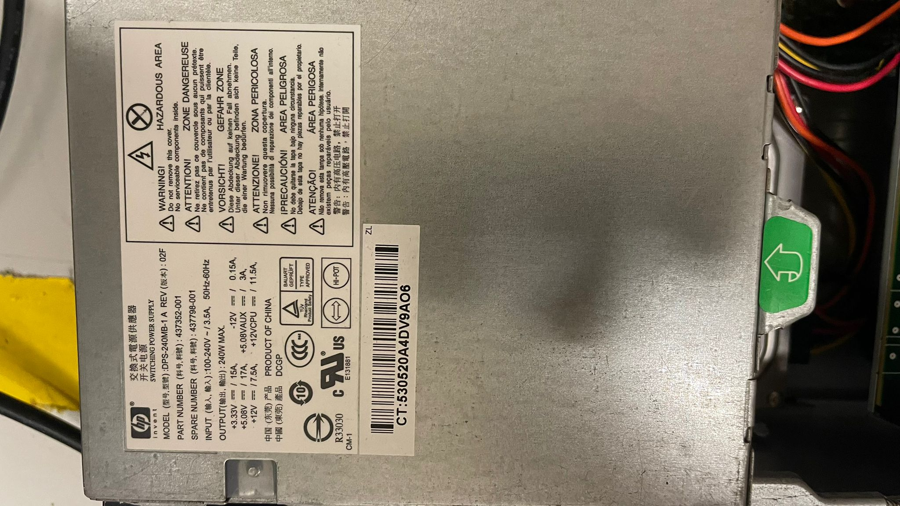
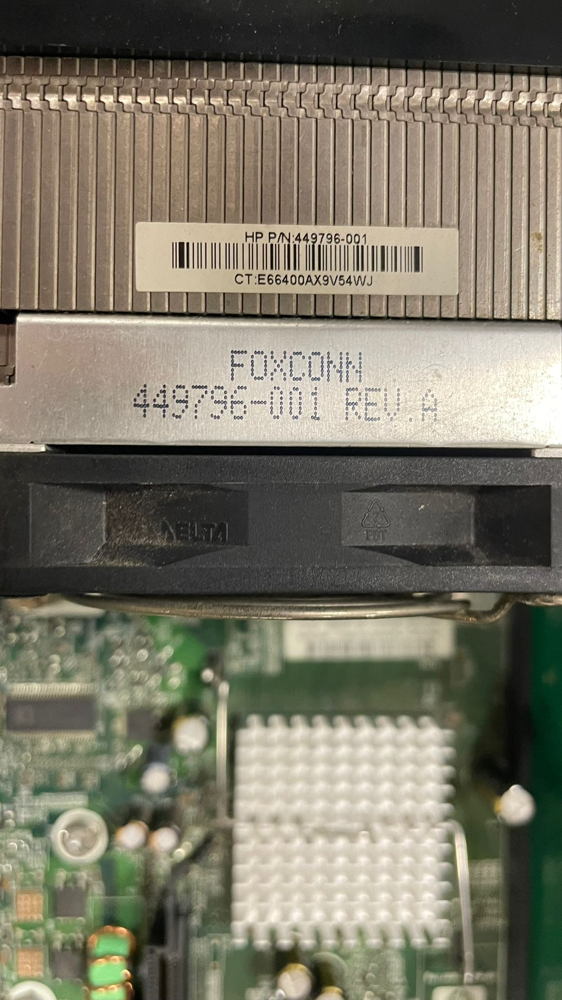

### Alumno: Alfonso Giménez Martínez

### ID de equipo: Grupo 1

### Características del equipo:

| Componente                  | Marca/Fabricante                              | Modelo/Serie                | Características técnicas visibles      | Foto                                |
| ----------------------------- | ----------------------------------------------- | ----------------------------- | ------------------------------------------ | ------------------------------------- |
| **Placa base**              | Hp Engineer                                   | Compac dc7800 versión: SFF | Chipset / Socket / Nº slots RAM         |            |
| **Microprocesador**         | Intel core 2 duo E6750 266Hz                  | Core2 duo E6750 266 Hz      | (Si es visible) Modelo / Frecuencia      |            |
| **Memoria RAM**             | Fabricante: Naya                              | 667 Mhz                     | Tipo ddr2 1GB x4                         |            |
| **Disco HDD/SSD**           | Samsung                                       | HD 161JG3 3,5'              | Interfaz: SATA                           |         |
| **Fuente de alimentación** | HP                                            | DPS- 240MB 100-250V         | Potencia (240), Certificación (80+): NO |  |
| **Otros (GPU/Tarjetas)**    | GPU integrada Tarjeta de red: A G belcon | Dual-band wireless          | Vel.transferencia: 56mb/s                |          |

### Versión de Linux instalada:

En este caso, inslamos Antix linux, ya que era la que más fluida iba, no nos dió ningún problema y tiene una interfaz muy intuitiva y fácil de usar.

Estado del disco duro:

Estado de la memoria RAM:

Comprobación de red:

Comprobación de temperaturas y estabilidad:

Incidencias detectadas:

Conclusión Final:
